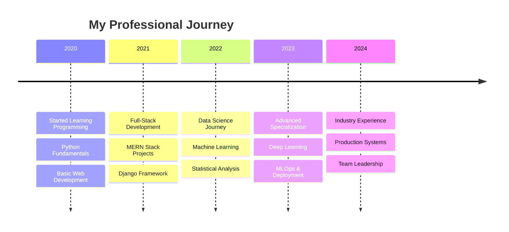

# Hi there, I'm Uddhav Bhattarai! 👋

  
  
  
  
  
  
  

 

  

 

  

## 🚀 About Me

I'm a dedicated **full-stack developer** and **data scientist** with a strong background in building dynamic, high-performance web applications using the **MERN stack** and **Django**. My journey spans from creating seamless user experiences to extracting meaningful insights from complex datasets.

🔹 **Full-Stack Development:** MERN Stack, Django REST Framework  
🔹 **Data Science:** Machine Learning, Deep Learning, Statistical Analysis  
🔹 **Data Engineering:** ETL Pipelines, Data Warehousing, Big Data  
🔹 **Data Analytics:** Business Intelligence, Visualization, Reporting  

- 🔭 Currently working on **AI-powered web applications** and **data-driven solutions**
- 🌱 Learning **Advanced Deep Learning** architectures and **MLOps**
- 👯 Open to collaborate on **open source projects** and **data science initiatives**
- 💬 Ask me about **MERN, Django, Python, Data Science, ML**
- 📊 Passionate about turning **data into actionable insights**
- ⚡ Fun fact: I love solving complex problems with **elegant code** and **beautiful visualizations**

 

## 🛠️ Tech Arsenal

### 🌐 Web Development

  
  

### 📊 Data Science & Analytics  

  
  
  
  
  
  

### 🗄️ Databases & Cloud

  

### 🔧 Development Tools

  

 

## 📊 GitHub Analytics

  
  

  

 

## 🏆 Achievement Showcase

  

 

## 📈 Contribution Graph

  

 

## 🎯 Featured Projects

  
| 🚀 **Full-Stack Applications** | 📊 **Data Science Projects** | 🤖 **AI/ML Solutions** |
|:---:|:---:|:---:|
|  |  |  |

### 🌟 Project Highlights

**🔹 Django REST E-Commerce Platform**  
*Tech Stack: Django, Django REST Framework, React, PostgreSQL*  
• Built scalable RESTful APIs serving 10k+ daily requests  
• Implemented JWT authentication and role-based access control  
• Integrated payment gateways and real-time notifications  

**🔹 Customer Churn Prediction Model**  
*Tech Stack: Python, Scikit-learn, Pandas, Plotly*  
• Developed ML model achieving 94% accuracy in churn prediction  
• Performed comprehensive EDA on 50k+ customer records  
• Created interactive dashboards for business stakeholders  

**🔹 Real-time Analytics Dashboard**  
*Tech Stack: MERN, Socket.io, Chart.js, MongoDB*  
• Built real-time data visualization platform  
• Processed streaming data with 99.9% uptime  
• Implemented responsive design with modern UI/UX  

 

## 📊 Data Science Journey

  <table>
    <tr>
      <td align="center" width="140">
        
         <strong>Python</strong>
      </td>
      <td align="center" width="140">
        
         <strong>Pandas</strong>
      </td>
      <td align="center" width="140">
        
         <strong>NumPy</strong>
      </td>
      <td align="center" width="140">
        
         <strong>Scikit-learn</strong>
      </td>
      <td align="center" width="140">
        
         <strong>TensorFlow</strong>
      </td>
    </tr>
  </table>

**🎯 Specializations:**  
Data Analysis • Machine Learning • Deep Learning • Statistical Modeling  
Data Engineering • Business Intelligence • Predictive Analytics

 

## 🌟 What I'm Currently Working On

🔹 **Advanced ML Models** - Building ensemble models for better predictions  
🔹 **Django Microservices** - Scalable architecture with Docker & Kubernetes  
🔹 **Real-time Data Pipeline** - Apache Kafka + Apache Spark integration  
🔹 **MLOps Implementation** - Model deployment and monitoring systems  
🔹 **Open Source Contributions** - Contributing to Python data science libraries  

 

## 📚 Technical Blog & Knowledge Sharing

<!-- BLOG-POST-LIST:START -->
- 📝 **Building Scalable Django REST APIs: Best Practices & Performance Tips**
- 📊 **From Raw Data to Business Insights: A Complete Data Science Pipeline**  
- 🤖 **Deep Learning for Web Applications: Integration Strategies**
- ⚡ **MERN Stack Performance Optimization: Advanced Techniques**
- 🔧 **Data Engineering with Python: ETL Pipelines at Scale**
<!-- BLOG-POST-LIST:END -->

 

## 💼 Professional Experience

 

## 🎯 Skills Matrix

  
| **Domain** | **Technologies** | **Proficiency** |
|:---:|:---|:---:|
| **Frontend** | React, Next.js, TypeScript, Tailwind CSS | ⭐⭐⭐⭐⭐ |
| **Backend** | Node.js, Express, Django, Django REST | ⭐⭐⭐⭐⭐ |
| **Data Science** | Python, Pandas, NumPy, Scikit-learn | ⭐⭐⭐⭐⭐ |
| **Machine Learning** | TensorFlow, PyTorch, Deep Learning | ⭐⭐⭐⭐⭐ |
| **Databases** | MongoDB, PostgreSQL, MySQL | ⭐⭐⭐⭐⭐ |
| **DevOps** | Docker, AWS, Git, CI/CD | ⭐⭐⭐⭐ |

 

## 🤝 Let's Connect & Collaborate

  
  
  
  
  
  
   
  
  
  
  
  

 

## 💡 Fun Facts & Interests

- 🧠 **Problem Solver** - Love tackling complex algorithmic challenges
- 📊 **Data Enthusiast** - Passionate about finding patterns in data
- 🎨 **UI/UX Advocate** - Believe great design drives user engagement  
- 🌱 **Continuous Learner** - Always exploring emerging technologies
- 🤝 **Community Builder** - Enjoy mentoring and knowledge sharing
- 🎯 **Goal-Oriented** - Focused on building impactful solutions
- 🔬 **Research-Minded** - Love diving deep into technical topics

 

---

  
  
  
  ### "Transforming ideas into intelligent solutions through code and data"
  
   
  
  **⭐ If you find my work interesting, please consider giving it a star! ⭐**
  
   
  
  
  

