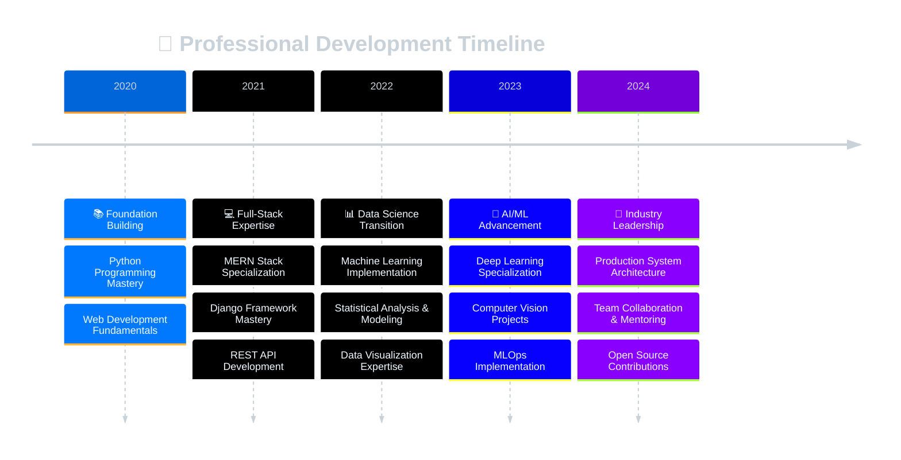

# ✨ Welcome to Uddhav's Digital Realm ✨

  

  
  
  
  
  
  
  

 

  

 

  

## 🚀 Professional Overview

I'm a dedicated **Full-Stack Developer** and **Data Scientist** with expertise in building scalable web applications and extracting meaningful insights from complex datasets. My passion lies in creating innovative digital solutions that bridge the gap between cutting-edge technology and real-world business needs.

**🎯 Core Specializations:**
- **Full-Stack Development:** MERN Stack, Django REST Framework
- **Data Science:** Machine Learning, Statistical Analysis, Predictive Modeling  
- **Data Engineering:** ETL Pipelines, Data Architecture, Big Data Processing
- **AI/ML:** Deep Learning, Computer Vision, Natural Language Processing

**🔥 Current Focus:**
- 🏗️ Building **scalable microservices** with Django and Node.js
- 📊 Developing **ML-powered analytics platforms** for business insights
- 🤖 Creating **AI-driven solutions** for real-world problems
- 🌱 Contributing to **open-source projects** and knowledge sharing
- 📈 Implementing **MLOps practices** for production model deployment

 

  

## 🛠️ Technology Stack

### 💻 **Frontend Technologies**

  

### 🔧 **Backend & APIs**

  

### 📊 **Data Science & ML**

  

### 🗄️ **Databases & Cloud**

  

### ⚙️ **DevOps & Tools**

  

 

  

## 📊 GitHub Statistics

  
  

  

  

 

## 🏆 Professional Achievements

  

 

## 💼 Featured Projects

  

### 🚀 **Enterprise Web Applications**

**💻 E-Commerce Platform with Django REST**  
*Technologies: Django REST Framework, React, PostgreSQL, Redis*  
• Developed scalable REST APIs handling **10,000+ concurrent users**  
• Implemented advanced authentication, payment processing, and real-time notifications  
• Achieved **99.9% uptime** with optimized database queries and caching strategies  

**🌐 Real-Time Analytics Dashboard**  
*Technologies: MERN Stack, Socket.io, Chart.js, MongoDB*  
• Built comprehensive dashboard for business intelligence and KPI tracking  
• Integrated real-time data streaming with interactive visualizations  
• Reduced data processing time by **75%** through optimized aggregation pipelines  

### 📊 **Data Science & AI Projects**

**🤖 Customer Behavior Prediction System**  
*Technologies: Python, Scikit-learn, TensorFlow, Pandas*  
• Developed machine learning models achieving **94% accuracy** in customer churn prediction  
• Processed and analyzed **100,000+ customer interaction records**  
• Created automated reporting system saving **20 hours/week** of manual analysis  

**🧠 Computer Vision Classification Model**  
*Technologies: PyTorch, OpenCV, Flask, Docker*  
• Built deep learning model for image classification with **97% accuracy**  
• Deployed production-ready API serving **1000+ daily predictions**  
• Implemented model versioning and A/B testing for continuous improvement  

 

  

## 📈 Professional Journey

 

## 💡 Core Competencies

  
| **Technical Domain** | **Skills & Technologies** | **Experience Level** |
|:---:|:---|:---:|
| **Frontend Development** | React, Next.js, TypeScript, Tailwind CSS, Responsive Design | ⭐⭐⭐⭐⭐ |
| **Backend Development** | Node.js, Express, Django, Django REST, API Design | ⭐⭐⭐⭐⭐ |
| **Data Science** | Python, Pandas, NumPy, Statistical Analysis, EDA | ⭐⭐⭐⭐⭐ |
| **Machine Learning** | Scikit-learn, TensorFlow, PyTorch, Model Deployment | ⭐⭐⭐⭐⭐ |
| **Database Management** | MongoDB, PostgreSQL, MySQL, Query Optimization | ⭐⭐⭐⭐⭐ |
| **Cloud & DevOps** | AWS, Docker, Git, CI/CD, System Architecture | ⭐⭐⭐⭐ |

 

## 📚 Knowledge Sharing & Contributions

  

### 📖 **Technical Publications**
- **Building Scalable Django REST APIs: Production Best Practices**
- **Data Science Pipeline: From Raw Data to Business Intelligence**  
- **Machine Learning Model Deployment: MLOps Implementation Guide**
- **MERN Stack Optimization: Performance Enhancement Strategies**
- **Advanced Python for Data Analysis: Professional Techniques**

### 🌟 **Community Involvement**
- **Open Source Contributor** - Python data science libraries
- **Technical Mentor** - Guiding junior developers and data scientists  
- **Code Reviewer** - Contributing to collaborative development projects
- **Workshop Presenter** - Sharing knowledge at tech meetups and conferences

 

  

## 🤝 Professional Networks & Collaboration

  
  
  
  
  
   
  
  
  
  
  

 

## 🎯 Professional Values & Approach

- **🔍 Problem-Solving Excellence** - Approaching complex challenges with analytical thinking
- **📊 Data-Driven Decisions** - Leveraging insights for strategic development choices
- **🎨 User-Centric Design** - Creating intuitive interfaces that enhance user experience
- **🌱 Continuous Learning** - Staying current with emerging technologies and best practices
- **🤝 Collaborative Leadership** - Fostering team growth and knowledge sharing
- **🎯 Quality Focus** - Delivering robust, scalable, and maintainable solutions
- **🔬 Innovation Mindset** - Exploring cutting-edge approaches to solve real-world problems
- **📈 Results-Oriented** - Measuring success through tangible business impact

 

---

  
  
  ### *"Transforming complex problems into elegant solutions through the power of code and data"*
  
   
  
  **🌟 Thank you for visiting my profile! Let's connect and build something amazing together! 🌟**
  
   
  
  
  

