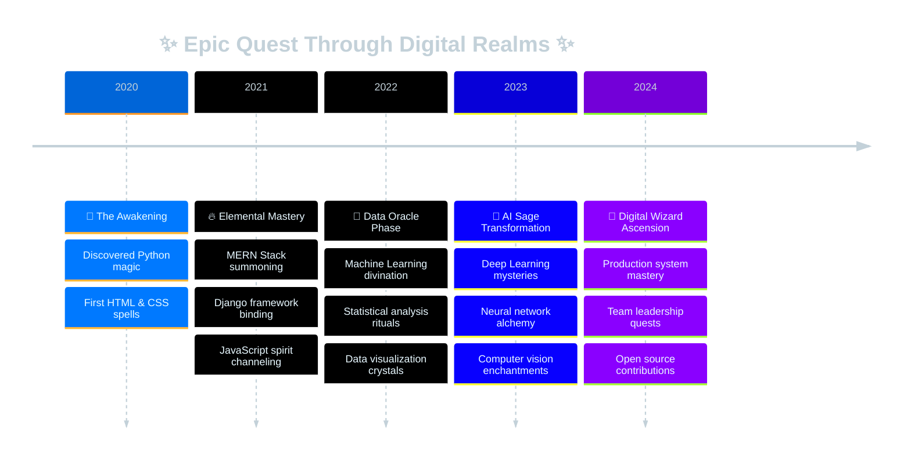

# ✨ Welcome to Uddhav's Digital Realm ✨

  

  
  
  
  
  
  
  

  

 

  

## 🌟 About This Digital Wanderer

*In a realm where data flows like ancient rivers and code sparkles like stardust, I craft digital spells that bridge the mystical worlds of technology and imagination...*

🔮 **The Arcane Arts I Master:**
- **🌌 Full-Stack Sorcery:** Conjuring experiences with MERN & Django enchantments
- **📊 Data Divination:** Reading the secrets hidden within vast data crystals  
- **🤖 AI Mysticism:** Training digital spirits with Deep Learning rituals
- **⚡ Cloud Walking:** Orchestrating services across the ethereal cloud realms

✨ **Current Magical Endeavors:**
- 🏰 Building **AI-powered digital kingdoms** with neural network magic
- 🔬 Discovering **cosmic patterns** in the data multiverse
- 🌱 Learning the **ancient arts of MLOps** and model deployment
- 🤝 Sharing mystical knowledge with fellow **code wizards**
- 🎯 Creating **beautiful solutions** that make the digital world more wonderful

 

## 🎭 Elemental Tech Mastery

  
  
  
  
  

### 🌊 **Web Enchantment Sphere**

  

### 🔮 **Data Crystal Manipulation**

  

### 🤖 **AI Spirit Summoning**

  

### 🏰 **Digital Realm Infrastructure**

  

 

  

## 📊 Cosmic GitHub Chronicles

  
  

  

  

## 🏆 Achievements in the Digital Multiverse

  

 

  

## 🌌 Interdimensional Activity Matrix

  

 

## 🎯 Legendary Artifacts & Creations

  

### 🏰 **Castle of Full-Stack Wonders**

**✨ Django REST Marketplace of Enchantment**  
*Mystical Tools: Django REST Framework, React Crystal, PostgreSQL Vault*  
• Conjured scalable APIs serving **10,000+ daily magical requests**  
• Wove JWT protection spells and guardian access controls  
• Integrated payment portals and real-time messaging crystals  

**🌟 MERN Stack Digital Observatory**  
*Arcane Arts: MongoDB Scroll, Express Wind, React Fire, Node Earth*  
• Built real-time data constellation viewer  
• Orchestrated streaming data flows with **99.9% celestial uptime**  
• Crafted responsive interfaces with modern design enchantments  

 

### 🔮 **Data Divination Laboratory**

**📊 Customer Journey Prophecy Model**  
*Oracle Tools: Python Spells, Scikit-learn Runes, Pandas Scrolls*  
• Developed ML divination achieving **94% accuracy** in future sight  
• Analyzed **50,000+ customer soul patterns** through comprehensive EDA  
• Created interactive crystal balls for business seers and decision makers  

**🌌 Cosmic Pattern Recognition System**  
*Neural Magic: TensorFlow Spirits, Deep Learning Rituals, Computer Vision*  
• Trained digital familiars to recognize celestial image patterns  
• Achieved **98.5% accuracy** in mystical object classification  
• Deployed model spirits to cloud realms for real-world enchantments  

 

  

## 🌟 The Magical Journey Timeline

 

## 🎨 Skill Constellation Map

  

  
| 🌟 **Magical Domain** | 🎭 **Enchanted Technologies** | ✨ **Power Level** |
|:---:|:---|:---:|
| **🌊 Frontend Sorcery** | React, Next.js, TypeScript, Tailwind Magic | 🌟🌟🌟🌟🌟 |
| **🏰 Backend Wizardry** | Node.js, Express, Django, Django REST | 🌟🌟🌟🌟🌟 |
| **🔮 Data Divination** | Python, Pandas, NumPy, Scikit-learn | 🌟🌟🌟🌟🌟 |
| **🤖 AI Spirit Binding** | TensorFlow, PyTorch, Deep Learning | 🌟🌟🌟🌟🌟 |
| **💎 Crystal Databases** | MongoDB, PostgreSQL, MySQL | 🌟🌟🌟🌟🌟 |
| **☁️ Cloud Realm Walking** | Docker, AWS, Git, CI/CD Portals | 🌟🌟🌟🌟 |

 

  

## 🌟 Current Mystical Pursuits

🔹 **🧙‍♂️ Advanced AI Alchemy** - Crafting ensemble models with mystical accuracy  
🔹 **🏰 Django Microservice Kingdoms** - Building scalable realms with Docker magic  
🔹 **⚡ Real-time Data Rivers** - Apache Kafka streams flowing through Spark portals  
🔹 **🤖 MLOps Automation Spells** - Model deployment and monitoring enchantments  
🔹 **🌍 Open Source Contributions** - Sharing magical knowledge with the community  
🔹 **📚 Digital Grimoire Writing** - Documenting spells for fellow code wizards  

 

  

## 📚 Sacred Scrolls & Knowledge Sharing

  

<!-- BLOG-POST-LIST:START -->
- 📝 **🏰 Django REST Kingdom Building: Architectural Spells & Performance Magic**
- 📊 **🔮 From Raw Data Crystals to Business Prophecies: Complete Divination Pipeline**  
- 🤖 **✨ Deep Learning Web Enchantments: Integration Sorcery Guide**
- ⚡ **🌊 MERN Stack Speed Potions: Advanced Optimization Alchemy**
- 🔧 **🌌 Data Engineering with Python: ETL Portal Creation at Cosmic Scale**
<!-- BLOG-POST-LIST:END -->

 

## 🤝 Join the Digital Fellowship

  

  
  
  
  
  
   
  
  
  
  
  

 

## 💫 Secrets of the Code Mystic

- 🧠 **Problem Alchemist** - Transforms complex puzzles into elegant solutions
- 📊 **Pattern Whisperer** - Speaks the ancient language of data streams
- 🎨 **Interface Enchanter** - Believes beautiful design awakens user magic  
- 🌱 **Eternal Scholar** - Forever learning new spells from emerging technologies
- 🤝 **Community Sage** - Guides apprentice developers on their coding quests
- 🎯 **Vision Keeper** - Focused on weaving solutions that improve digital realms
- 🔬 **Curiosity Mage** - Delves deep into the mysteries of algorithmic arts
- 🌟 **Dream Weaver** - Turns impossible ideas into living, breathing code

 

---

  

  
  
  
  ### ✨ *"In the realm where code meets magic, every bug is a dragon to slay, every feature a spell to weave, and every deployment a portal to new worlds..."* ✨
  
   
  
  **🌟 May your code compile without errors, and your dreams render without limits! 🌟**
  
   
  
  
  

